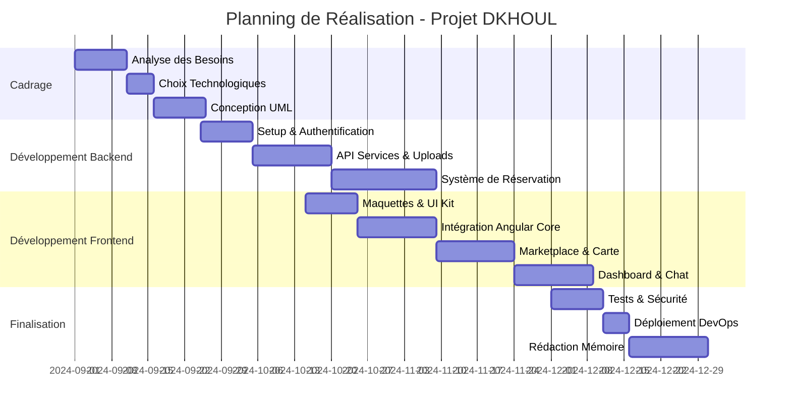
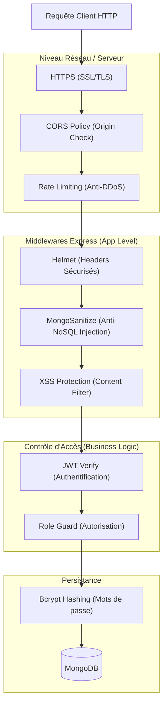
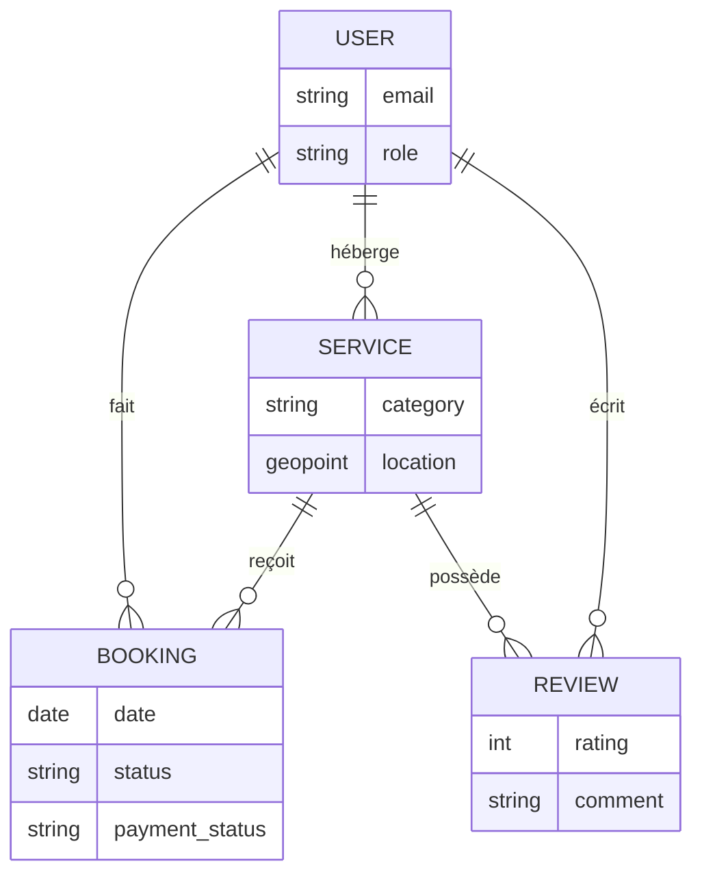

# ANNEXE : DIAGRAMMES BONUS (GESTION DE PROJET & SÉCURITÉ)

Pour donner une dimension vraiment professionnelle "Ingénieur" à votre mémoire, voici 3 diagrammes supplémentaires qui font souvent la différence devant le jury.

---

## 5. PLANNING PRÉVISIONNEL (Diagramme de GANTT)

*(À insérer dans l'Introduction ou la Gestion de Projet)*

Ce diagramme prouve que vous avez travaillé de manière organisée (Méthode Agile/Scrum).

---

## 6. ARCHITECTURE DE SÉCURITÉ (Defense in Depth)

*(À insérer dans le Chapitre 6 : Qualité & Sécurité)*

Ce diagramme inédit montre toutes les couches de protection que la requête traverse avant de toucher la base de données. C'est très valorisant pour la note technique.

---

## 7. MODÈLE LOGIQUE DE DONNÉES (ERD)

*(À insérer dans le Chapitre 4 : Conception)*

Une vue logique simplifiée des relations (Cardinalités) pour compléter le diagramme de classes.

