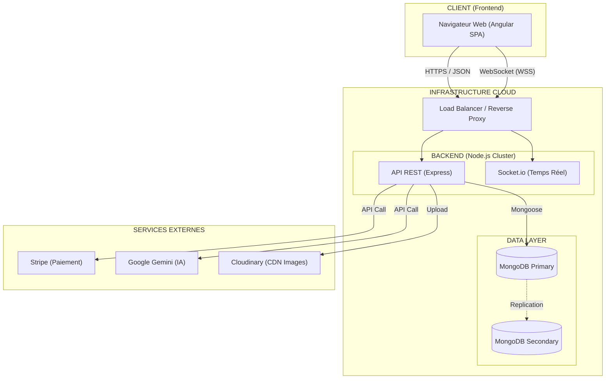
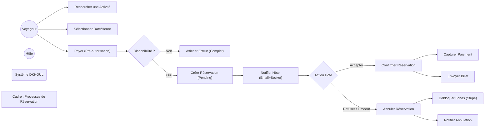
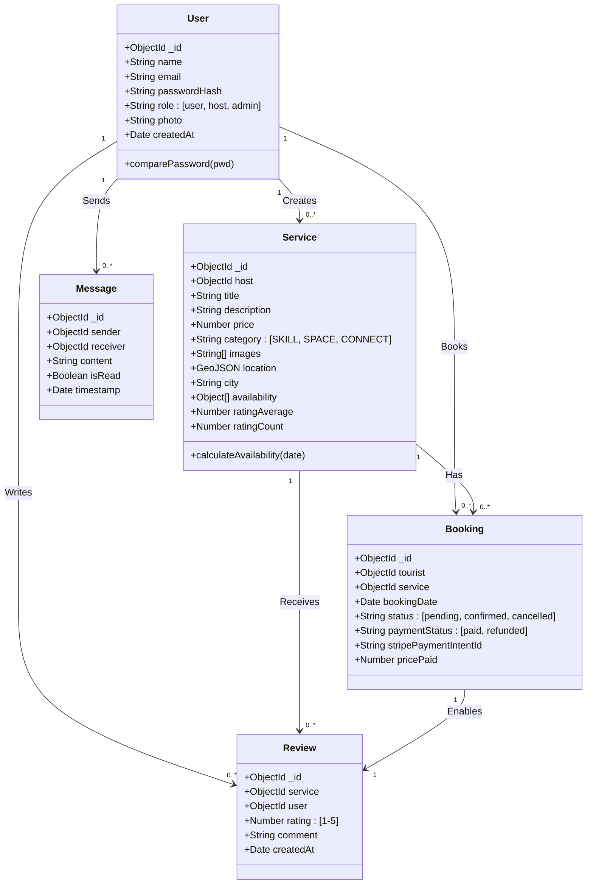
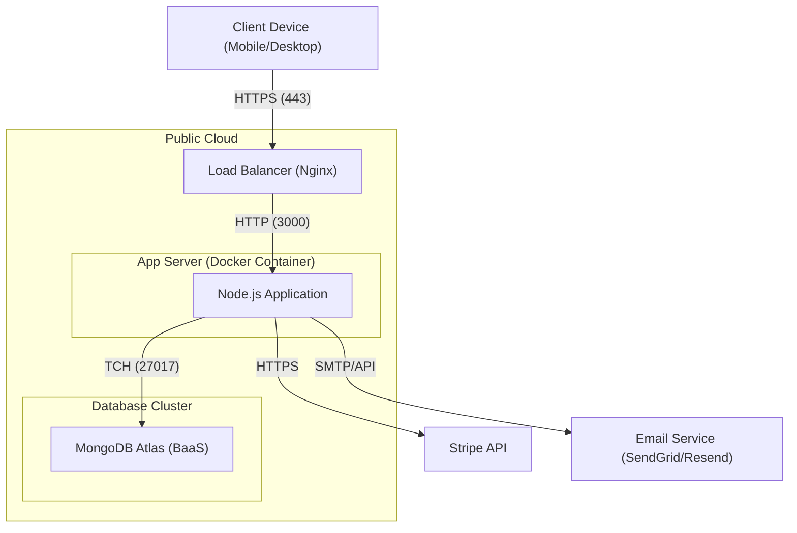
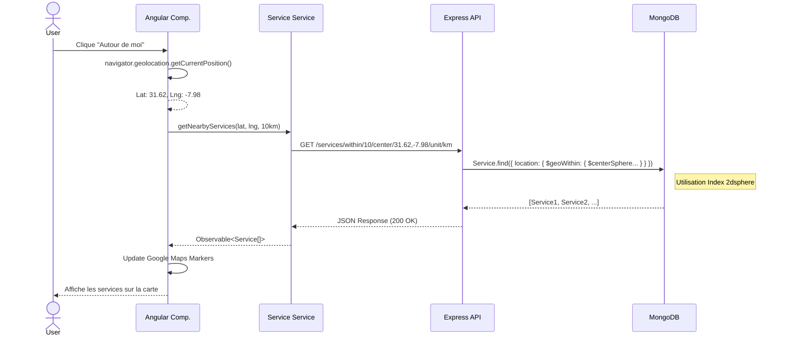

# ANNEXE : DIAGRAMMES UML (VERSION FINALE & CORRIGÉE)

Ce document regroupe l'ensemble des diagrammes techniques corrigés pour garantir une compatibilité maximale (Syntaxe Standard Mermaid).

---

## 1. DIAGRAMME D'ARCHITECTURE SYSTÈME (Global View)
*Représentation de l'architecture 3-Tiers et des flux de données.*

---

## 2. DIAGRAMME DE CAS D'UTILISATION DÉTAILLÉ (Réservation)
*Zoom sur le processus "Réserver un Service" avec les extensions et exceptions.*

---

## 3. DIAGRAMME DE CLASSES COMPLET
*Le modèle de données exhaustif.*

---

## 4. DIAGRAMME DE DÉPLOIEMENT (Infrastructure Physique)

---

## 5. DIAGRAMME DE SÉQUENCE : RECHERCHE GÉOLOCALISÉE
*Interaction pour "Trouver un service autour de moi".*

