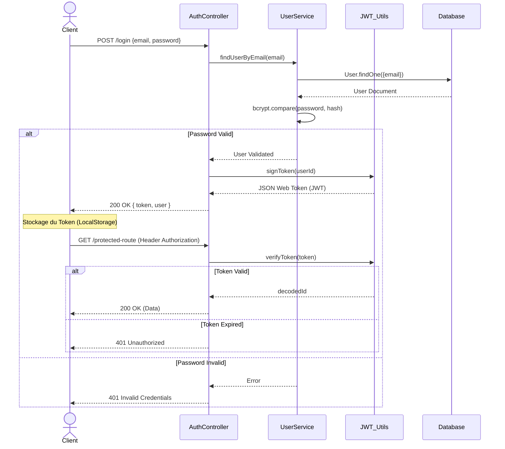

# ANNEXE SUPPLÉMENTAIRE : DIAGRAMMES UML AVANCÉS

Pour enrichir l'analyse technique et illustrer la complexité de l'infrastructure, voici une série de diagrammes supplémentaires à insérer dans les chapitres correspondants.

---

## 1. DIAGRAMME DE DÉPLOIEMENT (Infrastructure)

*(À insérer dans le Chapitre 7 : Déploiement)*

Ce diagramme illustre l'architecture physique de l'application hébergée dans le Cloud, mettant en évidence la conteneurisation et les services externes.

```mermaid
deploymentDiagram
    actor User as "Client (Navigateur Web)"
    
    node "Cloud Provider (Render/AWS)" {
        node "Load Balancer" as LB
        
        node "Docker Container: Backend API" {
            component "Express Server" as Express
            component "Socket.io Server" as Socket
        }
    }
    
    node "Vercel / Netlify" {
        component "Frontend (Angular SPA)" as ClientApp
    }
    
    database "MongoDB Atlas (Cluster)" {
        component "Primary Node"
        component "Secondary Node"
    }
    
    cloud "Services Externes" {
        component "Stripe (Paiement)" as Stripe
        component "Google Gemini (IA)" as AI
        component "Cloudinary (Images)" as IMG
    }

    User --> ClientApp : HTTPS
    ClientApp --> LB : API Requests (JSON)
    LB --> Express
    Express --> Primary Node : Read/Write
    Express --> Stripe : Secure Checkout
    Express --> AI : Prompts Generation
    Express --> IMG : Uploads
```

---

## 2. DIAGRAMME DE COMPOSANTS (Architecture Frontend)

*(À insérer dans le Chapitre 3 : Architecture, section Frontend)*

Ce diagramme détaille l'organisation modulaire de l'application Angular 19, montrant le découplage entre les "Features" et le "Core".

```mermaid
componentDiagram
    package "AppModule (Root)" {
        [AppComponent]
    }

    package "Core Module" {
        [AuthService]
        [AuthInterceptor]
        [AuthGuard]
    }

    package "Features (Lazy Loaded)" {
        component "MarketplaceModule" {
            [ServiceListComponent]
            [MapComponent]
        }
        
        component "BookingModule" {
            [CheckoutComponent]
            [PaymentStatusComponent]
        }
        
        component "DashboardModule" {
            [HostStatsComponent]
            [MyBookingsComponent]
        }
    }

    package "Shared Module" {
        [ButtonComponent]
        [NavbarComponent]
        [ServiceCardComponent]
    }

    [AppComponent] --> [NavbarComponent]
    [ServiceListComponent] ..> [AuthService] : Uses
    [CheckoutComponent] ..> [AuthGuard] : Protected by
    [HostStatsComponent] --> [ServiceCardComponent] : Reuses
```

---

## 3. DIAGRAMME D'ACTIVITÉ (Workflow Intelligence Artificielle)

*(À insérer dans le Chapitre 5 : Réalisation, section IA)*

Il décrit le processus logique complexe de traitement d'une question utilisateur par l'assistant virtuel "Chakib".

```mermaid
flowchart TD
    Start([Utilisateur pose une question]) --> Auth{Utilisateur Connecté ?}
    Auth -- Non --> Error[Redirection Login]
    Auth -- Oui --> FetchContext[Récupérer Historique Chat MongoDB]
    
    FetchContext --> SystemPrompt[Injecter Persona 'Chakib Guide']
    SystemPrompt --> APICall[Appel API Google Gemini]
    
    APICall --> Success{Succès API ?}
    
    Success -- Non --> Backup[Appel API Backup (OpenRouter ?)]
    Backup --> Success
    
    Success -- Oui --> Parse[Parser Réponse Texte]
    Parse --> SaveDB[Sauvegarder dans MongoDB (User + Model)]
    SaveDB --> Display[Afficher Réponse Client]
    
    Display --> End([Fin])
```

---

## 4. DIAGRAMME DE SÉQUENCE (Authentification & Sécurité)

*(À insérer dans le Chapitre 4 : Conception)*

Détaille le flux d'authentification Statless via JWT, depuis le Login jusqu'à l'accès à une route protégée.


