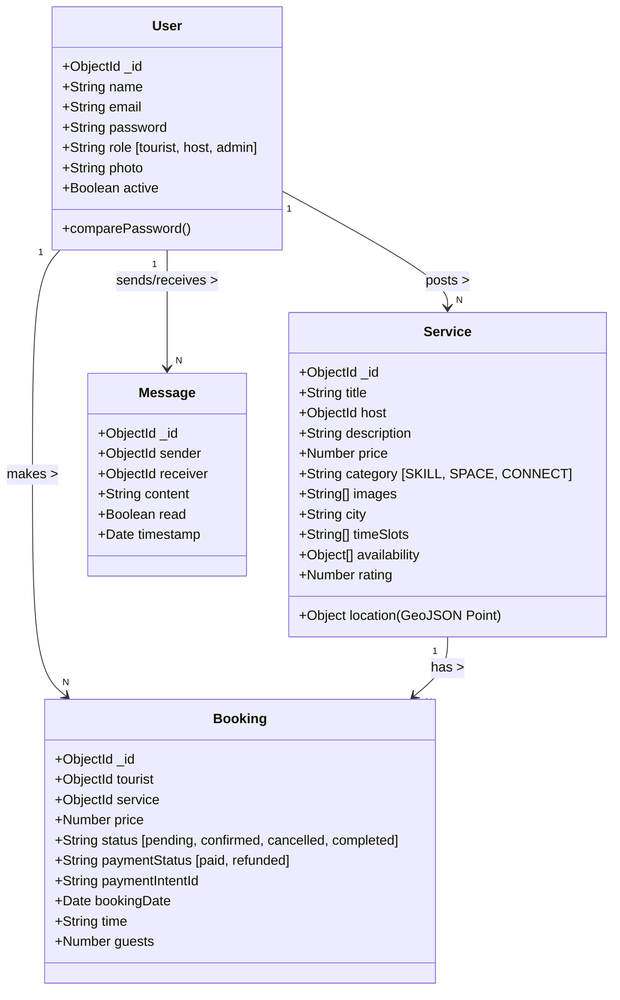
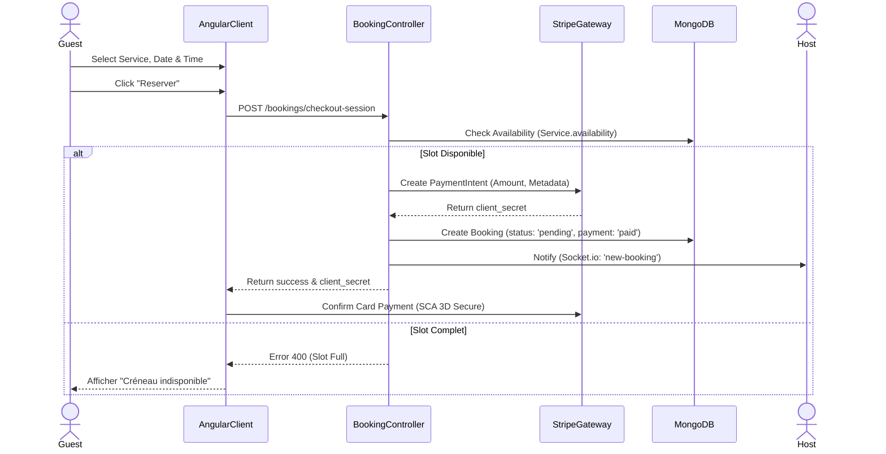

# MÉMOIRE DE PROJET DE FIN D'ÉTUDES

## PARTIE 2 : ARCHITECTURE ET CONCEPTION (Chapitres 3 & 4)

---

# CHAPITRE 3 : ARCHITECTURE TECHNIQUE ET LOGICIELLE

## 3.1 Vue D'ensemble : Architecture 3-Tiers Découplée

Pour répondre aux exigences de scalabilité et de maintenabilité définies dans l'analyse, nous avons rejeté l'approche monolithique (où le code serveur génère les pages HTML) au profit d'une **architecture distribuée 3-Tiers** (Client-Serveur-Données). Cette architecture permet de séparer clairement les responsabilités, facilitant ainsi le travail collaboratif et l'évolution future du produit (ex: développement d'une application mobile sans refaire le backend).

L'architecture globale du système **DKHOUL** repose sur la stack **MEAN** (MongoDB, Express, Angular, Node.js), une solution "Full JavaScript" garantissant une cohérence syntaxique et structurelle de bout en bout (JSON everywhere).

### 3.1.1 La Couche Présentation (Client / Frontend)

Le client est une **Single Page Application (SPA)** développée avec **Angular 19**.

* **Rôle** : Gérer l'interface utilisateur, la navigation (Routing) et le rendu dynamique des données sans rechargement de page.
* **Communication** : Le client ne possède aucune logique métier critique ni accès direct à la base de données. Il dialogue avec le serveur via des requêtes HTTP asynchrones (REST API) pour les données CRUD et via WebSockets (Socket.io) pour les événements temps-réel (Chat, Notifications).
* **Innovations** : Utilisation des **Standalone Components** et des **Signals** (voir Chapitre 4) pour optimiser les performances de rendu.

### 3.1.2 La Couche Applicative (Serveur / Backend)

Le serveur est une application **Node.js** utilisant le framework **Express**.

* **Rôle** : Point d'entrée unique sécurisé. Il authentifie les requêtes (JWT Middleware), exécute la logique métier (ex: "Un utilisateur peut-il annuler cette réservation ?"), et orchestre les interactions avec les services tiers (Stripe, Email, Uploads).
* **Stateless** : L'API est "sans état". Chaque requête HTTP contient toutes les informations nécessaires à son traitement (Token d'authentification). Cela permet une scalabilité horizontale aisée (ajout de nœuds serveurs sans synchronisation de session).

### 3.1.3 La Couche de Données (Persistance)

La couche de persistance est assurée par **MongoDB**, une base de données NoSQL orientée documents.

* **Rôle** : Stocker les données de manière flexible et performante, notamment les données géospatiales des services et les structures hiérarchiques complexes des réservations.

---

## 3.2 Patrons de Conception (Design Patterns)

### 3.2.1 Backend : Architecture MVC (Modèle-Vue-Contrôleur)

Bien que notre API ne rende pas de "Vues" HTML, nous avons maintenu une structure MVC adaptée aux APIs REST :

* **Modèles (`/models/`)** : Définissent la structure des données (Schémas Mongoose) et les règles de validation (ex: "Le prix ne peut pas être négatif"). C'est la seule couche qui communique avec MongoDB.
* **Contrôleurs (`/controllers/`)** : Contiennent la logique métier. Ils reçoivent la requête, interrogent le Modèle, appliquent les transformations nécessaires, et renvoient une réponse JSON standardisée (JSend format).
* **Routes (`/routes/`)** : Jouent le rôle d'aiguilleur. Elles associent une URL et une méthode HTTP (GET /services) à une fonction de contrôleur spécifique, tout en interposant des Middlewares de sécurité (Auth, Validation).

### 3.2.2 Frontend : Architecture Component-Service

Angular impose une architecture stricte :

* **Services Singleton** : Classes injectables (Dependency Injection) responsables de la communication avec l'API et de la gestion de l'état global (State Management). *Exemple : `AuthService`, `BookingService`*.
* **Composants Intelligents (Smart Components)** : Pages principales qui injectent les services, récupèrent les données et les passent aux composants enfants. *Exemple : `MarketplaceComponent`*.
* **Composants de Présentation (Dumb Components)** : Composants purement visuels qui reçoivent des données en entrée (`@Input`) et émettent des événements en sortie (`@Output`), sans dépendance au serveur. *Exemple : `ServiceCardComponent`, `StarRatingComponent`*.

---

# CHAPITRE 4 : MODÉLISATION ET CHOIX TECHNOLOGIQUES

## 4.1 Modélisation des Données (Data Class Diagram)

Le cœur de la plateforme repose sur une modélisation rigoureuse des entités.

### 4.1.1 Diagramme de Classes (UML)

Le diagramme suivant illustre les relations statiques entre nos entités principales.



### 4.1.2 Justification du NoSQL (MongoDB)

Pourquoi ne pas avoir utilisé une base de données relationnelle classique (SQL) comme PostgreSQL ?

1. **Polymorphisme des Services** : Dans DKHOUL, un "Service" peut être radicalement différent (une chambre d'hôte vs un cours de poterie). Avec SQL, cela nécessiterait soit une table géante avec beaucoup de colonnes vides (`NULL`), soit des jointures complexes (Table `Logement`, Table `Activité`). Avec MongoDB, les documents sont **schemaless** : nous pouvons stocker des champs spécifiques dans le champ `metadata` d'un service sans altérer la structure globale.
2. **Performance Géospatiale** : MongoDB intègre nativement les index **2dsphere** et les opérateurs `$near` et `$geoWithin`, optimisés pour les calculs de proximité géographique (Cercle, Polygone), essentiels pour notre fonctionnalité "Services autour de moi".

---

## 4.2 Modélisation Dynamique (Comportement)

### 4.2.1 Diagramme de Séquence : Flux de Réservation

Le processus de réservation est critique. Il implique une coordination entre le Client, l'API, la Base de Données et la passerelle de Paiement (Stripe).



### 4.2.2 Diagramme d'États : Cycle de Vie de la Réservation

```mermaid
stateDiagram-v2
    [*] --> Pending : Guest Pays & Books
    
    state Pending {
        note right of Pending: Fond bloqués par Stripe, en attente validation Hôte
    }

    Pending --> Confirmed : Host Accepts
    Pending --> Cancelled : Host Rejects / Timeout (48h)
    
    state Confirmed {
        note right of Confirmed: Créneau retiré du calendrier
    }

    Confirmed --> Completed : Date du service passée
    Confirmed --> Cancelled : Host/Guest Cancels (Politique de Remboursement)
    
    Cancelled --> [*] : Remboursement (Refund)
    Completed --> [*] : Avis (Review) autorisé
```

---

## 4.3 Justification des Choix Technologiques Critiques

### 4.3.1 Frontend : Angular 19 & Signals vs React

Nous avons privilégié Angular 19 pour sa robustesse en entreprise.

* **Signals** : Contrairement à React qui nécessite souvent des librairies tierces (Redux, Zustand) pour gérer l'état complexe, Angular 19 intègre les **Signals**. Cette primitive réactive permet de mettre à jour le DOM de manière chirurgicale (Fine-Grained Reactivity). Si le prix d'un service change, seul le nœud texte du prix est mis à jour, sans re-rendre tout le composant. C'est crucial pour la performance sur mobile.
* **TypeScript Natif** : Le typage fort évite une classe entière de bugs (ex: essayer d'accéder au nom d'un utilisateur `undefined`) dès la phase de compilation.

### 4.3.2 Backend : Node.js Event Loop

Node.js utilise un modèle **"Single Threaded Event Loop"**.

* Pour une application de type "Marketplace" (beaucoup d'entrées/sorties : appels BDD, appels Stripe, Upload image), ce modèle est bien plus performant que les modèles multi-threadés (Java/PHP) qui bloquent un thread par requête. Node.js peut gérer des milliers de connexions concurrentes en attente (Non-blocking I/O) avec une faible empreinte mémoire.

### 4.3.3 Communication Temps-Réel : Socket.io

Pourquoi pas simplement du HTTP Polling (requêter le serveur toutes les 5s) ?

* **Latence** : Le Polling introduit un délai inacceptable pour un Chat.
* **Charge Serveur** : Le Polling sature le serveur de requêtes inutiles.
* **Solution** : Socket.io établit une connexion WebSocket persistante (TCP). Le serveur peut "pousser" (Push) l'information vers le client. C'est indispensable pour notifier l'hôte : *"Ping ! Vous avez une nouvelle demande de réservation"*.

---
*(Fin de la Partie 2 - La suite détaillera l'implémentation code)*
